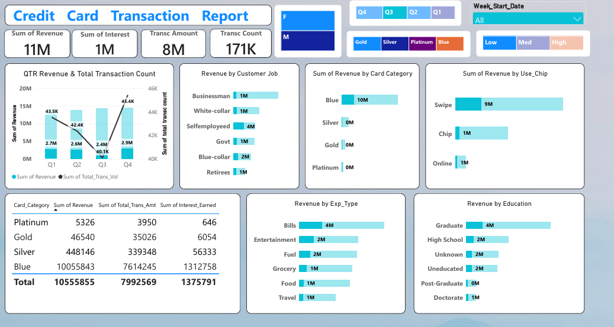
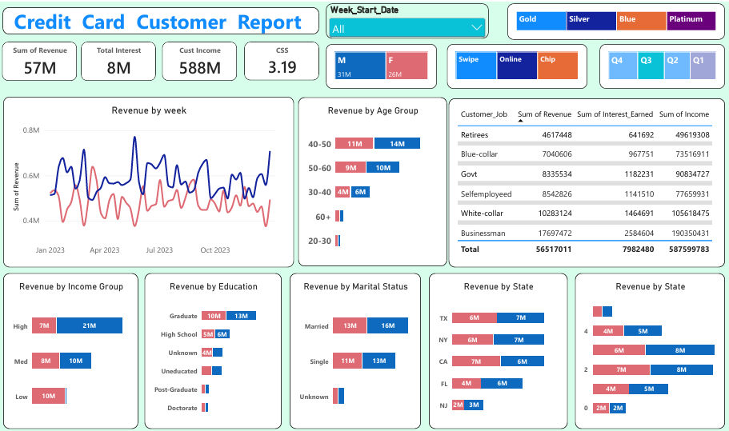

# 💳 Credit Card Financial Dashboard

An end-to-end data analytics project that transforms raw credit card transaction and customer data into actionable business insights using **SQL** and **Power BI**.

---

## 📌 Problem Statement

Banks and financial institutions generate massive volumes of credit card transaction and customer data every week. Without a centralized reporting system, it's difficult to track revenue trends, customer segments, and risk indicators in real time.

This project builds a **weekly-updating financial dashboard** that answers key business questions:
- How is revenue trending quarter over quarter?
- Which customer segments (job, education, income, age) generate the most revenue?
- How do card categories (Blue, Silver, Gold, Platinum) perform against each other?
- What are customers' spending habits (chip vs swipe vs online, expense type)?

---

## 🗂️ Dataset

Two related datasets, loaded and joined via SQL:
- **Credit Card Details** (`cc_detail`) — Card category, annual fees, credit limit, revolving balance, transaction amount/volume, utilization ratio, interest earned, delinquency status
- **Customer Details** (`cust_detail`) — Age, gender, education, marital status, state, income, job, customer satisfaction score

Data is ingested weekly (`cc_add.csv`, `cust_add.csv`) to simulate a real-world recurring reporting pipeline.

---

## 🛠️ Tools & Tech Stack

| Tool | Purpose |
|------|---------|
| **MySQL** | Database design, data ingestion (`LOAD DATA INFILE`), data cleaning |
| **SQL** | Schema creation, data validation, cleanup queries |
| **Power BI** | Data modeling, DAX measures, interactive dashboard visualization |

---

## ⚙️ Approach

1. **Database Design** — Created two relational tables (`cc_detail`, `cust_detail`) linked by `Client_Num`
2. **Data Ingestion** — Loaded weekly CSV batches into MySQL using `LOAD DATA LOCAL INFILE`, simulating an incremental/recurring data pipeline
3. **Data Cleaning** — Identified and removed invalid records (e.g., malformed `Week_Start_Date` entries)
4. **Data Modeling** — Connected MySQL to Power BI, built relationships between customer and transaction tables
5. **Dashboard Development** — Built two interactive report pages with slicers (Quarter, Gender, Card Category, Utilization Level, Week)

---

## 📊 Dashboard Overview

### Page 1: Credit Card Transaction Report
- **KPIs:** Total Revenue (11M), Total Interest (1M), Transaction Amount (8M), Transaction Count (171K)
- Quarterly revenue and transaction volume trend
- Revenue breakdown by Card Category, Customer Job, Expense Type, Education, and Chip Usage method



### Page 2: Credit Card Customer Report
- **KPIs:** Total Revenue (57M), Total Interest (8M), Customer Income (588M), Customer Satisfaction Score (3.19)
- Weekly revenue trend (Male vs Female)
- Revenue segmented by Age Group, Income Group, Education, Marital Status, and State



---

## 🔑 Key Findings

- **Blue card holders** drive the majority of total revenue (10M of 11M total), making them the core customer base despite lower per-card fees
- **Businessmen** are the highest-revenue customer segment by job type, followed by white-collar and self-employed customers
- **Swipe transactions** account for the largest share of revenue (9M) compared to chip and online payments
- **Bills** are the top expense category driving revenue, followed by entertainment and fuel
- Revenue skews toward customers aged **40–60**, suggesting this is the bank's core demographic
- **High-income customers** contribute disproportionately more revenue than medium/low-income groups

---

## 🚀 How to Run This Project

1. Clone this repository
2. Run `Credit_Card_Financial_Dashboard_SQL_Query.sql` in MySQL Workbench to create the database and tables
3. Update the `LOAD DATA LOCAL INFILE` file paths to match your local CSV locations
4. Open the `.pbix` Power BI file and refresh the data connection to your local MySQL instance

---

## 📁 Repository Structure

```
├── Credit_Card_Financial_Dashboard_SQL_Query.sql   # Database schema + data ingestion
├── Credit_Card_Dashboard.pbix                       # Power BI dashboard file
├── screenshots/                                      # Dashboard preview images
└── README.md
```

---

## 👤 Author

**Farhan Adil**
Data Analyst | AI Automation Enthusiast
